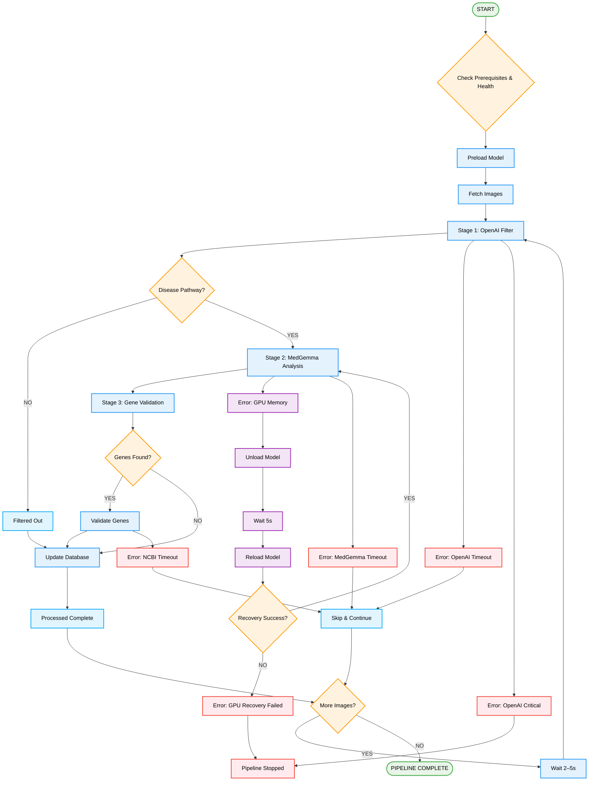

```mermaid
graph TD
    Start([START]) --> PreCheck{Check Prerequisites & Health}
    PreCheck --> PreLoad[Preload Model]
    PreLoad --> FetchImages[Fetch Images]

    FetchImages --> Stage1[Stage 1: OpenAI Filter]
    Stage1 --> OpenAIDecision{Disease Pathway?}
    Stage1 --> OpenAITimeout[Error: OpenAI Timeout]
    Stage1 --> OpenAICritical[Error: OpenAI Critical]

    OpenAIDecision -->|NO| FilteredOut[Filtered Out]
    OpenAIDecision -->|YES| Stage2[Stage 2: MedGemma Analysis]

    Stage2 --> Stage3[Stage 3: Gene Validation]
    Stage2 --> GPUError[Error: GPU Memory]
    Stage2 --> MedGemmaTimeout[Error: MedGemma Timeout]

    GPUError --> UnloadModel[Unload Model]
    UnloadModel --> WaitGPU[Wait 5s]
    WaitGPU --> ReloadModel[Reload Model]
    ReloadModel --> RecoveryDecision{Recovery Success?}
    RecoveryDecision -->|YES| Stage2
    RecoveryDecision -->|NO| GPUFailed[Error: GPU Recovery Failed]

    Stage3 --> GenesDecision{Genes Found?}
    GenesDecision -->|YES| ValidateGenes[Validate Genes]
    GenesDecision -->|NO| UpdateDB[Update Database]

    ValidateGenes --> UpdateDB
    ValidateGenes --> NCBIError[Error: NCBI Timeout]

    FilteredOut --> UpdateDB
    UpdateDB --> Success[Processed Complete]

    Success --> NextRecord{More Images?}
    NextRecord -->|YES| DelayNext[Wait 2–5s]
    DelayNext --> Stage1
    NextRecord -->|NO| PipelineComplete([PIPELINE COMPLETE])

    %% Error flows
    OpenAITimeout --> ContinueNext[Skip & Continue]
    MedGemmaTimeout --> ContinueNext
    NCBIError --> ContinueNext
    ContinueNext --> NextRecord

    OpenAICritical --> StopPipeline[Pipeline Stopped]
    GPUFailed --> StopPipeline

    %% Styling
    classDef startNode fill:#e8f5e8,stroke:#4caf50,stroke-width:2px,color:#000
    classDef processNode fill:#e3f2fd,stroke:#2196f3,stroke-width:2px,color:#000
    classDef decisionNode fill:#fff3e0,stroke:#ff9800,stroke-width:2px,color:#000
    classDef successNode fill:#e8f5e8,stroke:#4caf50,stroke-width:2px,color:#000
    classDef errorNode fill:#ffebee,stroke:#f44336,stroke-width:2px,color:#000
    classDef recoveryNode fill:#f3e5f5,stroke:#9c27b0,stroke-width:2px,color:#000
    classDef continueNode fill:#e1f5fe,stroke:#03a9f4,stroke-width:2px,color:#000

    class Start,PipelineComplete startNode
    class PreLoad,FetchImages,Stage1,Stage2,Stage3,ValidateGenes,UpdateDB,DelayNext processNode
    class PreCheck,OpenAIDecision,GenesDecision,RecoveryDecision,NextRecord decisionNode
    class Success,FilteredOut,ContinueNext continueNode
    class OpenAITimeout,OpenAICritical,MedGemmaTimeout,GPUFailed,NCBIError,StopPipeline errorNode
    class GPUError,UnloadModel,WaitGPU,ReloadModel recoveryNode


```