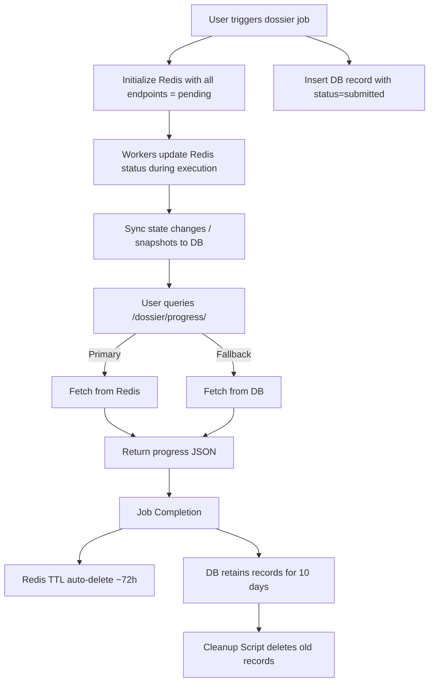

# Dossier Progress Tracking Design (Hybrid: Redis + DB)

## Overview
This document outlines a **hybrid design** for dossier progress tracking.  
The goal is to provide real-time progress visibility for each endpoint involved in dossier processing.

---

## Requirements
- Track statuses for **all endpoints** (`pending`, `processing`, `processed`, `error`).
- Real-time updates for users.
- Must survive Redis crashes (no complete data loss).
- Temporary data retention (1–10 days), auto-cleaned after completion.

---

## Hybrid Approach
### Redis
- Stores **live progress** per job.
- Fast reads/writes.
- TTL auto-expiry (e.g., 72h).

### Database
- Stores **backup + history**.
- Keeps job states for up to **10 days**.
- Automation script (cron/Celery beat) clears old records.

---

## Flow
1. **Job Start**
   - Redis entry created with all endpoints set to `pending`.
   - DB entry created with initial state (`submitted`).

2. **During Execution**
   - Workers update Redis as endpoints run.
   - Periodic snapshots (or state changes) synced to DB.

3. **Job Completion**
   - Redis TTL cleans record after ~72h.
   - DB retains record for ~10 days.

4. **Cleanup**
   - Automation job deletes old DB records daily.
   - Redis auto-expires.

---

## API Design
**Endpoint:**
```
GET /dossier/progress/{target}/{disease}
```

**Response:**
```json
{
  "target": "PCSK9",
  "disease": "obesity",
  "progress": {
    "get_evidence_literature_semaphore": "processed",
    "get_mouse_studies": "processing",
    "get_network_biology_semaphore": "pending"
  },
  "status": "in-progress"
}
```

---

## Diagram


---

## Benefits
- **Performance** → Fast Redis responses.
- **Resilience** → DB fallback ensures no data loss.
- **History** → Debugging support for 10 days.
- **Cleanup** → Automated pruning keeps DB light.
